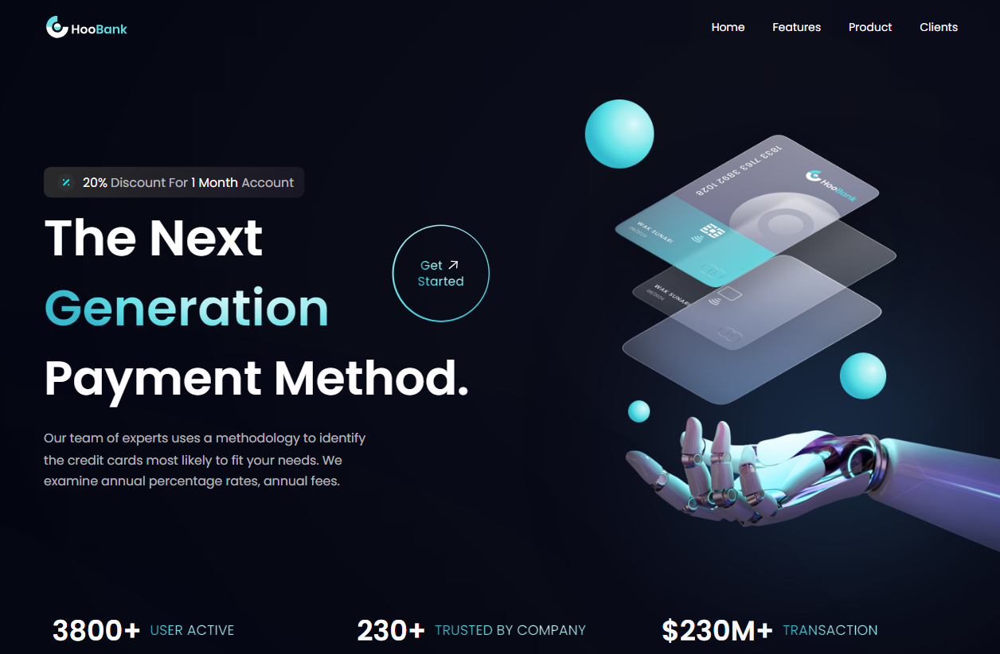

# HooBank App

Bem-vindo ao repositório da [página](https://hoobank-app-sigma.vercel.app/) do HooBank - A Nova Forma de Facilitar seus Pagamentos!

## Descrição

O [HooBank](https://hoobank-app-sigma.vercel.app/) é um aplicativo inovador que oferece uma experiência moderna e eficiente para facilitar seus pagamentos e transações financeiras. Com uma interface amigável e recursos avançados, o HooBank é a escolha perfeita para simplificar sua vida financeira.

## Principais Características

- **Interface Intuitiva:** Navegue facilmente pelo aplicativo com uma interface intuitiva e amigável ao usuário.

- **Pagamentos Rápidos e Seguros:** Realize pagamentos de forma rápida, segura e conveniente.

- **Controle Financeiro:** Acompanhe seus gastos, visualize extratos e mantenha o controle total das suas finanças.

- **Cartão de Crédito Personalizado:** Encontre as melhores ofertas de cartões de crédito personalizados para suas necessidades.

- **Ofertas Exclusivas:** Desfrute de ofertas exclusivas e promoções especiais ao usar o HooBank.

## Tecnologias Utilizadas

- React.js
- Tailwind CSS

## Contribuição

Sinta-se à vontade para contribuir com melhorias no HooBank. Se encontrar problemas ou tiver sugestões, abra uma issue ou envie um pull request.

## Créditos

- **Design:** One Week Wonders 
- **Desenvolvimento:** Hugo Henrique

---

Espero que aproveite o HooBank! Caso tenha alguma dúvida ou feedback, entre em contato comigo em [hugohenrique.1004@gmail.com](mailto:hugohenrique.1004@gmail.com).